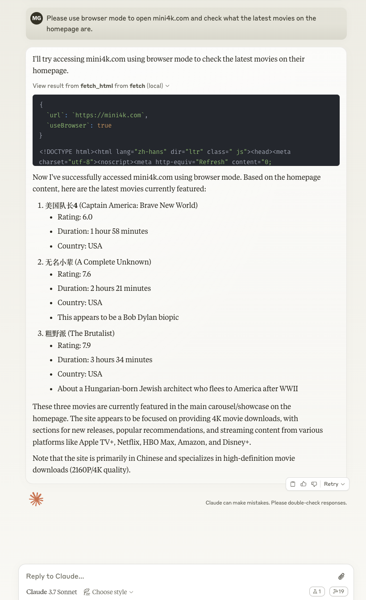

# mult-fetch-mcp-server

[](https://www.npmjs.com/package/@lmcc-dev/mult-fetch-mcp-server)
[](https://opensource.org/licenses/MIT)
[](https://nodejs.org/)
[](https://www.typescriptlang.org/)
[](https://github.com/modelcontextprotocol/typescript-sdk)
[](https://github.com/lmcc-dev/mult-fetch-mcp-server/stargazers)
[](https://github.com/lmcc-dev/mult-fetch-mcp-server/network/members)
[](https://github.com/lmcc-dev/mult-fetch-mcp-server/issues)
[](https://github.com/lmcc-dev/mult-fetch-mcp-server/pulls)
[](https://www.npmjs.com/package/@lmcc-dev/mult-fetch-mcp-server)
[](https://github.com/lmcc-dev/mult-fetch-mcp-server/commits/main)
[](https://github.com/lmcc-dev/mult-fetch-mcp-server/graphs/contributors)

<!-- Future badges to consider:
[](https://codecov.io/gh/lmcc-dev/mult-fetch-mcp-server)
[](https://www.codefactor.io/repository/github/lmcc-dev/mult-fetch-mcp-server)
[](https://codeclimate.com/github/lmcc-dev/mult-fetch-mcp-server/maintainability)
-->

This project implements an MCP-compliant client and server for communication between AI assistants and external tools.

[English](./README.md) | [中文文档](./README.zh.md)

## Project Structure

```
fetch-mcp/
├── src/                # Source code directory
│   ├── lib/            # Library files
│   │   ├── BrowserFetcher.ts # Browser mode fetcher
│   │   ├── NodeFetcher.ts    # Node.js mode fetcher
│   │   ├── server/           # Server-related modules
│   │   │   ├── index.ts      # Server entry point
│   │   │   ├── browser.ts    # Browser management
│   │   │   ├── fetcher.ts    # Web fetching logic
│   │   │   ├── logger.ts     # Logging utilities
│   │   │   ├── tools.ts      # Tool registration and handling
│   │   │   └── types.ts      # Server type definitions
│   │   ├── i18n/             # Internationalization support
│   │   │   ├── index.ts      # i18n configuration
│   │   │   └── logger.ts     # i18n logger utilities
│   │   └── types.ts          # Common type definitions
│   ├── client.ts       # MCP client implementation
│   └── mcp-server.ts   # MCP server main entry
├── index.ts            # Server entry point
├── tests/              # Test files
│   ├── test-mcp.ts     # MCP functionality tests
│   ├── test-mini4k.ts  # Specific website tests
│   └── test-direct-client.ts # Direct client call tests
└── dist/               # Compiled files
    ├── index.js        # Compiled entry point
    ├── src/            # Compiled source code
    └── tests/          # Compiled test files
```

## MCP Specification

The Model Context Protocol (MCP) defines two main transport methods:

1. **Standard Input/Output (Stdio)**: The client starts the MCP server as a child process, and they communicate through standard input (stdin) and standard output (stdout).
2. **Server-Sent Events (SSE)**: Used to pass messages between client and server.

This project implements the Standard Input/Output (Stdio) transport method.

## Features

- Implementation based on the official MCP SDK
- Support for Standard Input/Output (Stdio) transport
- Multiple web scraping methods (HTML, JSON, text, Markdown)
- Intelligent mode switching: automatically switches between standard requests and browser mode
- Detailed debug logs output to standard error stream
- Support for Chinese and English bilingual internationalization
- Modular design for easy maintenance and extension

## Installation

### Local Installation

```bash
npm install
```

### Global Installation

```bash
npm install -g @lmcc-dev/mult-fetch-mcp-server
```

Or use npx to run directly (no installation required):

```bash
npx @lmcc-dev/mult-fetch-mcp-server
```

## Integration with Claude

To integrate this tool with Claude desktop, you need to add server configuration:

### Configuration File Location

- **MacOS**: `~/Library/Application Support/Claude/claude_desktop_config.json`
- **Windows**: `%APPDATA%/Claude/claude_desktop_config.json`

### Configuration Examples

#### Method 1: Using npx (Recommended)

This method is the simplest, doesn't require specifying the full path, and is suitable for global installation or direct use with npx:

```json
{
  "mcpServers": {
    "mult-fetch-mcp-server": {
      "command": "npx",
      "args": ["@lmcc-dev/mult-fetch-mcp-server"],
      "env": {
        "MCP_LANG": "en"  // Set language to English, options: "zh" or "en"
      }
    }
  }
}
```

#### Method 2: Specifying Full Path

If you need to use a specific installation location, you can specify the full path:

```json
{
  "mcpServers": {
    "mult-fetch-mcp-server": {
      "command": "path-to/bin/node",
      "args": ["path-to/@lmcc-dev/mult-fetch-mcp-server/dist/index.js"],
      "env": {
        "MCP_LANG": "en"  // Set language to English, options: "zh" or "en"
      }
    }
  }
}
```

Please replace `path-to/bin/node` with the path to the Node.js executable on your system, and replace `path-to/@lmcc-dev/mult-fetch-mcp-server` with the actual path to this project.

### Usage Examples

Below is an example of using this tool in Claude desktop client:



The image shows how Claude can use the fetch tools to retrieve web content and process it according to your instructions.

### Usage

After configuration, restart Claude desktop, and you can use the following tools in your conversation:

- `fetch_html`: Get HTML content of a webpage
- `fetch_json`: Get JSON data
- `fetch_txt`: Get plain text content
- `fetch_markdown`: Get Markdown formatted content

## Build

```bash
npm run build
```

## Run Server

```bash
npm run server
# or
node dist/index.js
# if globally installed, you can run directly
@lmcc-dev/mult-fetch-mcp-server
# or use npx
npx @lmcc-dev/mult-fetch-mcp-server
```

## Run Client

```bash
npm run client <method> <params_json>
# example
npm run client fetch_html '{"url": "https://example.com", "debug": true}'
```

## Run Tests

```bash
# Run MCP functionality tests
npm run test:mcp

# Run mini4k.com website tests
npm run test:mini4k

# Run direct client call tests
npm run test:direct
```

## Language Settings

This project supports Chinese and English bilingual internationalization. You can set the language using environment variables:

### Using Environment Variables

Set the `MCP_LANG` environment variable to control the language:

```bash
# Set to English
export MCP_LANG=en
npm run server

# Set to Chinese
export MCP_LANG=zh
npm run server

# Windows system
set MCP_LANG=zh
npm run server
```

Using environment variables ensures that all related processes (including the MCP server) use the same language settings.

### Default Language

By default, the system will choose a language according to the following priority:
1. `MCP_LANG` environment variable
2. Operating system language (if it starts with "zh", use Chinese)
3. English (as the final fallback option)

## Debugging

This project follows the MCP protocol specification and does not output any logs by default to avoid interfering with JSON-RPC communication. Debug information is controlled through call parameters:

### Using the debug Parameter

Set the `debug: true` parameter when calling a tool:

```json
{
  "url": "https://example.com",
  "debug": true
}
```

Debug messages are sent to the standard error stream (stderr) using the following format:

```
[MCP-SERVER] MCP server starting...
[CLIENT] Fetching URL: https://example.com
```

### Debug Log File

When debug mode is enabled, all debug messages are also written to a log file located at:

```
~/.mult-fetch-mcp-server/debug.log
```

This log file can be accessed through the MCP resources API:

```typescript
// Access the debug log file
const result = await client.readResource({ uri: "file:///logs/debug" });
console.log(result.contents[0].text);

// Clear the debug log file
const clearResult = await client.readResource({ uri: "file:///logs/clear" });
console.log(clearResult.contents[0].text);
```

## Proxy Settings

This tool supports various methods to configure proxy settings:

### 1. Using the `proxy` Parameter

The most direct way is to specify the proxy in the request parameters:

```json
{
  "url": "https://example.com",
  "proxy": "http://your-proxy-server:port",
  "debug": true
}
```

### 2. Using Environment Variables

The tool will automatically detect and use proxy settings from standard environment variables:

```bash
# Set proxy environment variables
export HTTP_PROXY=http://your-proxy-server:port
export HTTPS_PROXY=http://your-proxy-server:port

# Run the server
npm run server
```

### 3. System Proxy Detection

The tool attempts to detect system proxy settings based on your operating system:

- **Windows**: Reads proxy settings from environment variables using the `set` command
- **macOS/Linux**: Reads proxy settings from environment variables using the `env` command

### 4. Proxy Troubleshooting

If you're having issues with proxy detection:

1. Use the `debug: true` parameter to see detailed logs about proxy detection
2. Explicitly specify the proxy using the `proxy` parameter
3. Ensure your proxy URL is in the correct format: `http://host:port` or `https://host:port`
4. For websites that require browser capabilities, set `useBrowser: true` to use browser mode

### 5. Browser Mode and Proxies

When using browser mode (`useBrowser: true`), the tool will:

1. First try to use the explicitly specified proxy (if provided)
2. Then try to use system proxy settings
3. Finally, proceed without a proxy if none is found

Browser mode is particularly useful for websites that implement anti-scraping measures or require JavaScript execution.

## Parameter Handling

This project handles parameters in the following ways:

- **debug**: Passed through call parameters, each request can individually control whether to enable debug output
- **MCP_LANG**: Retrieved from environment variables, controls the language settings of the entire server

## Usage

### Creating a Client

```typescript
import { Client } from '@modelcontextprotocol/sdk/client/index.js';
import { StdioClientTransport } from '@modelcontextprotocol/sdk/client/stdio.js';
import path from 'path';
import { fileURLToPath } from 'url';

// Get the directory path of the current file
const __filename = fileURLToPath(import.meta.url);
const __dirname = path.dirname(__filename);

// Create client transport layer
const transport = new StdioClientTransport({
  command: 'node',
  args: [path.resolve(__dirname, 'dist/index.js')],
  stderr: 'inherit',
  env: {
    ...process.env  // Pass all environment variables, including MCP_LANG
  }
});

// Create client
const client = new Client({
  name: "example-client",
  version: "1.0.0"
});

// Connect to transport layer
await client.connect(transport);

// Use client
const result = await client.callTool({
  name: 'fetch_html',
  arguments: {
    url: 'https://example.com',
    debug: true  // Control debug output through parameters
  }
});

if (result.isError) {
  console.error('Fetch failed:', result.content[0].text);
} else {
  console.log('Fetch successful!');
  console.log('Content preview:', result.content[0].text.substring(0, 500));
}
```

### Supported Tools

- `fetch_html`: Get HTML content of a webpage
- `fetch_json`: Get JSON data
- `fetch_txt`: Get plain text content
- `fetch_markdown`: Get Markdown formatted content

### Resources Support

The server includes support for the resources/list and resources/read methods, but currently no resources are defined in the implementation. The resource system is designed to provide access to project files and documentation, but this feature is not fully implemented yet.

#### Resource Usage Example

```typescript
// Example: List available resources
const resourcesResult = await client.listResources({});
console.log('Available resources:', resourcesResult);

// Note: Currently this will return empty lists for resources and resourceTemplates
```

### Supported Prompt Templates

The server provides the following prompt templates:

- `fetch-website`: Get website content, supporting different formats and browser mode
- `extract-content`: Extract specific content from a website, supporting CSS selectors and data type specification
- `debug-fetch`: Debug website fetching issues, analyze possible causes and provide solutions

#### Prompt Template Usage

1. Use `prompts/list` to get a list of available prompt templates
2. Use `prompts/get` to get specific prompt template content

```typescript
// Example: List available prompt templates
const promptsResult = await client.listPrompts({});
console.log('Available prompts:', promptsResult);

// Example: Get website content prompt
const fetchPrompt = await client.getPrompt({
  name: "fetch-website",
  arguments: {
    url: "https://example.com",
    format: "html",
    useBrowser: "false"
  }
});
console.log('Fetch website prompt:', fetchPrompt);

// Example: Debug website fetching issues
const debugPrompt = await client.getPrompt({
  name: "debug-fetch",
  arguments: {
    url: "https://example.com",
    error: "Connection timeout"
  }
});
console.log('Debug fetch prompt:', debugPrompt);
```

### Parameter Options

Each tool supports the following parameters:

#### Basic Parameters
- `url`: URL to fetch (required)
- `headers`: Custom request headers (optional, default is {})
- `proxy`: Proxy server URL in format http://host:port or https://host:port (optional)

#### Network Control Parameters
- `timeout`: Timeout in milliseconds (optional, default is 30000)
- `maxRedirects`: Maximum number of redirects to follow (optional, default is 10)
- `noDelay`: Whether to disable random delay between requests (optional, default is false)
- `useSystemProxy`: Whether to use system proxy (optional, default is true)

#### Mode Control Parameters
- `useBrowser`: Whether to use browser mode (optional, default is false)
- `useNodeFetch`: Whether to force using Node.js mode (optional, default is false, mutually exclusive with `useBrowser`)
- `autoDetectMode`: Whether to automatically detect and switch to browser mode (optional, default is true)

#### Browser Mode Specific Parameters
- `waitForSelector`: Selector to wait for in browser mode (optional, default is 'body')
- `waitForTimeout`: Timeout to wait in browser mode in milliseconds (optional, default is 5000)
- `scrollToBottom`: Whether to scroll to the bottom of the page in browser mode (optional, default is false)
- `saveCookies`: Whether to save cookies in browser mode (optional, default is true)
- `closeBrowser`: Whether to close the browser instance (optional, default is false)

#### Debug Parameters
- `debug`: Whether to enable debug output (optional, default is false)

### Special Usage

#### Closing Browser Without Fetching
To close the browser instance without performing any fetch operation:
```json
{
  "url": "about:blank",
  "closeBrowser": true
}
```

#### Proxy Priority
The proxy is determined in the following order:
1. Command line specified proxy
2. `proxy` parameter in the request
3. Environment variables (if `useSystemProxy` is true)
4. Git configuration (if `useSystemProxy` is true)

If `proxy` is set, `useSystemProxy` will be automatically set to false.

### Debug Output

When `debug: true` is set, the logs will be output to stderr with the following prefixes:
- `[MCP-SERVER]`: Logs from the MCP server
- `[NODE-FETCH]`: Logs from the Node.js fetcher
- `[BROWSER-FETCH]`: Logs from the browser fetcher
- `[CLIENT]`: Logs from the client

## License

MIT

---

Updated by lmcc-dev