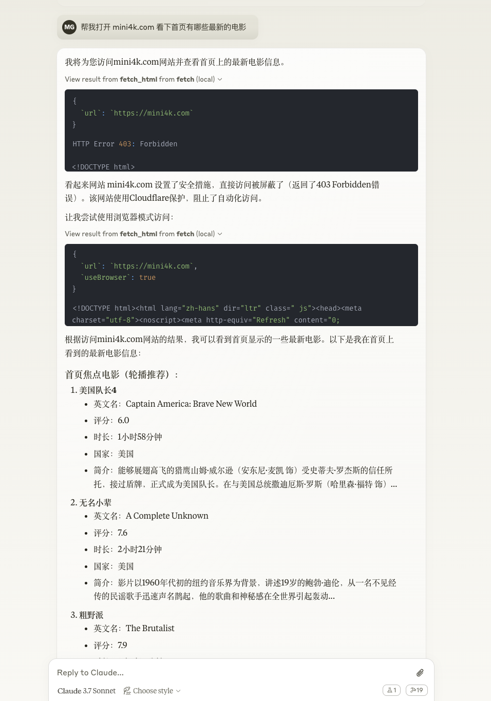

# mult-fetch-mcp-server

[](https://www.npmjs.com/package/@lmcc-dev/mult-fetch-mcp-server)
[](https://opensource.org/licenses/MIT)
[](https://nodejs.org/)
[](https://www.typescriptlang.org/)
[](https://github.com/modelcontextprotocol/typescript-sdk)
[](https://github.com/lmcc-dev/mult-fetch-mcp-server/stargazers)
[](https://github.com/lmcc-dev/mult-fetch-mcp-server/network/members)
[](https://github.com/lmcc-dev/mult-fetch-mcp-server/issues)
[](https://github.com/lmcc-dev/mult-fetch-mcp-server/pulls)
[](https://www.npmjs.com/package/@lmcc-dev/mult-fetch-mcp-server)
[](https://github.com/lmcc-dev/mult-fetch-mcp-server/commits/main)
[](https://github.com/lmcc-dev/mult-fetch-mcp-server/graphs/contributors)
[](https://codecov.io/gh/lmcc-dev/mult-fetch-mcp-server)
[](https://www.codefactor.io/repository/github/lmcc-dev/mult-fetch-mcp-server)


<!-- 未来可考虑添加的徽章:
[](https://codeclimate.com/github/lmcc-dev/mult-fetch-mcp-server/maintainability)
-->

本项目实现了一个符合MCP规范的客户端和服务器，用于在AI助手和外部工具之间进行通信。

[English](./README.md) | [中文文档](./README.zh.md)

## 项目结构

```
fetch-mcp/
├── src/                         # 源代码目录
│   ├── lib/                     # 库文件
│   │   ├── fetchers/            # 网页获取实现
│   │   │   ├── browser/         # 基于浏览器的获取
│   │   │   │   ├── BrowserFetcher.ts      # 浏览器获取实现
│   │   │   │   ├── BrowserInstance.ts     # 浏览器实例管理
│   │   │   │   └── PageOperations.ts      # 页面交互操作
│   │   │   ├── node/            # 基于Node.js的获取
│   │   │   └── common/          # 共享获取工具
│   │   ├── utils/               # 工具模块
│   │   │   ├── ChunkManager.ts        # 内容分块功能
│   │   │   ├── ContentProcessor.ts    # HTML到文本转换
│   │   │   ├── ContentSizeManager.ts  # 内容大小限制
│   │   │   └── ErrorHandler.ts        # 错误处理
│   │   ├── server/              # 服务器相关模块
│   │   │   ├── index.ts         # 服务器入口
│   │   │   ├── browser.ts       # 浏览器管理
│   │   │   ├── fetcher.ts       # 网页获取逻辑
│   │   │   ├── tools.ts         # 工具注册和处理
│   │   │   ├── resources.ts     # 资源处理
│   │   │   ├── prompts.ts       # 提示模板
│   │   │   └── types.ts         # 服务器类型定义
│   │   ├── i18n/                # 国际化支持
│   │   └── types.ts             # 通用类型定义
│   ├── client.ts                # MCP 客户端实现
│   └── mcp-server.ts            # MCP 服务器主入口
├── index.ts                     # 服务器入口点
├── tests/                       # 测试文件
└── dist/                        # 编译后的文件
```

## MCP规范

模型上下文协议（Model Context Protocol, MCP）定义了两种主要的传输方式：

1. **标准输入输出（Stdio）**：客户端将MCP服务器作为子进程启动，双方通过标准输入（stdin）和标准输出（stdout）进行通信。
2. **服务器发送事件（Server-Sent Events, SSE）**：用于在客户端和服务器之间传递消息。

本项目实现了基于标准输入输出（Stdio）的传输方式。

## 特性

- 基于官方 MCP SDK 的实现
- 支持标准输入输出（Stdio）传输方式
- 提供了多种网页抓取方法（HTML、JSON、文本、Markdown、纯文本转换）
- 智能模式切换：自动在标准请求和浏览器模式之间切换
- 内容大小管理：自动将大型内容分割成可管理的块，以解决AI模型上下文大小限制问题
- 分块内容检索：能够请求大型内容的特定块，同时保持上下文连续性
- 详细的调试日志输出到标准错误流
- 支持中英文双语国际化
- 模块化设计，便于维护和扩展

## 安装

### 通过 Smithery 安装

要通过 [Smithery](https://smithery.ai/server/@lmcc-dev/mult-fetch-mcp-server) 自动为 Claude 桌面版安装 Mult Fetch MCP Server：

```bash
npx -y @smithery/cli install @lmcc-dev/mult-fetch-mcp-server --client claude
```

### 本地安装

```bash
pnpm install
```

### 全局安装

```bash
pnpm add -g @lmcc-dev/mult-fetch-mcp-server
```

或者直接使用 npx 运行（无需安装）：

```bash
npx @lmcc-dev/mult-fetch-mcp-server
```

## 与 Claude 集成

要将此工具与 Claude 桌面版集成，需要添加服务器配置：

### 配置文件位置

- **MacOS**: `~/Library/Application Support/Claude/claude_desktop_config.json`
- **Windows**: `%APPDATA%/Claude/claude_desktop_config.json`

### 配置示例

#### 方式一：使用 npx（推荐）

这种方式最简单，不需要指定完整路径，适合全局安装或直接使用 npx：

```json
{
  "mcpServers": {
    "mult-fetch-mcp-server": {
      "command": "npx",
      "args": ["mult-fetch-mcp-server"],
      "env": {
        "MCP_LANG": "zh"  // 设置语言为中文，可选值: "zh" 或 "en"
      }
    }
  }
}
```

#### 方式二：指定完整路径

如果您需要使用特定位置的安装，可以指定完整路径：

```json
{
  "mcpServers": {
    "mult-fetch-mcp-server": {
      "command": "path-to/bin/node",
      "args": ["path-to/@lmcc-dev/mult-fetch-mcp-server/dist/index.js"],
      "env": {
        "MCP_LANG": "zh"  // 设置语言为中文，可选值: "zh" 或 "en"
      }
    }
  }
}
```

请将 `path-to/bin/node` 替换为您系统上 Node.js 可执行文件的路径，将 `path-to/@lmcc-dev/mult-fetch-mcp-server` 替换为此项目的实际路径。

### 使用示例

以下是在 Claude 桌面客户端中使用此工具的示例：



图片展示了 Claude 如何使用 fetch 工具获取网页内容并根据您的指令进行处理。

### 使用方法

配置完成后，重启 Claude 桌面版，然后您可以在对话中使用以下工具：

- `fetch_html`: 获取网页 HTML 内容
- `fetch_json`: 获取 JSON 数据
- `fetch_txt`: 获取纯文本内容
- `fetch_markdown`: 获取 Markdown 格式内容
- `fetch_plaintext`: 获取从HTML转换的纯文本内容（去除HTML标签）

## 构建

```bash
pnpm run build
```

## 运行服务器

```bash
pnpm run server
# 或者
node dist/index.js
# 如果全局安装，可以直接运行
mult-fetch-mcp-server
# 或者使用 npx
npx mult-fetch-mcp-server
```

## 运行客户端

```bash
pnpm run client <method> <params_json>
# 例如
pnpm run client fetch_html '{"url": "https://example.com", "debug": true}'
```

## 运行测试

```bash
# 运行 MCP 功能测试
npm run test:mcp

# 运行 mini4k.com 网站测试
npm run test:mini4k

# 运行直接客户端调用测试
npm run test:direct
```

## 语言设置

本项目支持中英文双语国际化。您可以使用环境变量设置语言：

### 使用环境变量

设置 `MCP_LANG` 环境变量来控制语言：

```bash
# 设置为英文
export MCP_LANG=en
npm run server

# 设置为中文
export MCP_LANG=zh
npm run server

# Windows 系统
set MCP_LANG=zh
npm run server
```

使用环境变量的方式可以确保所有相关进程（包括 MCP 服务器）都使用相同的语言设置。

### 默认语言

默认情况下，系统会按照以下优先级选择语言：
1. `MCP_LANG` 环境变量
2. 操作系统语言（如果以 "zh" 开头，则使用中文）
3. 英文（作为最终回退选项）

## 调试

本项目遵循 MCP 协议的规范，默认情况下不会输出任何日志，以避免干扰 JSON-RPC 通信。调试信息通过调用参数控制：

### 使用 debug 参数

在调用工具时，设置 `debug: true` 参数：

```json
{
  "url": "https://example.com",
  "debug": true
}
```

调试消息会发送到标准错误流（stderr），使用以下格式：

```
[MCP-SERVER] MCP 服务器启动中...
[CLIENT] 正在获取URL: https://example.com
```

### 调试日志文件

当启用调试模式时，所有调试消息也会写入到位于以下位置的日志文件：

```
~/.mult-fetch-mcp-server/debug.log
```

可以通过 MCP 资源 API 访问此日志文件：

```typescript
// 访问调试日志文件
const result = await client.readResource({ uri: "file:///logs/debug" });
console.log(result.contents[0].text);

// 清除调试日志文件
const clearResult = await client.readResource({ uri: "file:///logs/clear" });
console.log(clearResult.contents[0].text);
```

日志文件包含来自所有组件（服务器、客户端、获取器）的带时间戳的条目，可用于排查问题。

## 代理设置

本工具支持多种配置代理设置的方法：

### 1. 使用 `proxy` 参数

最直接的方式是在请求参数中指定代理：

```json
{
  "url": "https://example.com",
  "proxy": "http://your-proxy-server:port",
  "debug": true
}
```

### 2. 使用环境变量

工具会自动检测并使用标准环境变量中的代理设置：

```bash
# 设置代理环境变量
export HTTP_PROXY=http://your-proxy-server:port
export HTTPS_PROXY=http://your-proxy-server:port

# 运行服务器
npm run server
```

### 3. 系统代理检测

工具会根据您的操作系统尝试检测系统代理设置：

- **Windows**：使用 `set` 命令从环境变量中读取代理设置
- **macOS/Linux**：使用 `env` 命令从环境变量中读取代理设置

### 4. 代理故障排除

如果您在代理检测方面遇到问题：

1. 使用 `debug: true` 参数查看有关代理检测的详细日志
2. 使用 `proxy` 参数明确指定代理
3. 确保您的代理 URL 格式正确：`http://host:port` 或 `https://host:port`
4. 对于需要浏览器功能的网站，设置 `useBrowser: true` 使用浏览器模式

### 5. 浏览器模式和代理

当使用浏览器模式（`useBrowser: true`）时，工具将：

1. 首先尝试使用明确指定的代理（如果提供）
2. 然后尝试使用系统代理设置
3. 最后，如果没有找到代理，则不使用代理继续

浏览器模式对于实现了反爬虫措施或需要 JavaScript 执行的网站特别有用。

## 参数处理

本项目采用以下方式处理参数：

- **debug**: 通过调用参数传递，每个请求可以单独控制是否启用调试输出
- **MCP_LANG**: 通过环境变量获取，控制整个服务器的语言设置

## 使用方法

### 创建客户端

```typescript
import { Client } from '@modelcontextprotocol/sdk/client/index.js';
import { StdioClientTransport } from '@modelcontextprotocol/sdk/client/stdio.js';
import path from 'path';
import { fileURLToPath } from 'url';

// 获取当前文件的目录路径
const __filename = fileURLToPath(import.meta.url);
const __dirname = path.dirname(__filename);

// 创建客户端传输层
const transport = new StdioClientTransport({
  command: 'node',
  args: [path.resolve(__dirname, 'dist/index.js')],
  stderr: 'inherit',
  env: {
    ...process.env  // 传递所有环境变量，包括MCP_LANG
  }
});

// 创建客户端
const client = new Client({
  name: "example-client",
  version: "1.0.0"
});

// 连接到传输层
await client.connect(transport);

// 使用客户端
const result = await client.callTool({
  name: 'fetch_html',
  arguments: {
    url: 'https://example.com',
    debug: true  // 通过参数控制调试输出
  }
});

if (result.isError) {
  console.error('获取失败:', result.content[0].text);
} else {
  console.log('获取成功!');
  console.log('内容预览:', result.content[0].text.substring(0, 500));
}
```

### 支持的工具

- `fetch_html`: 获取网页HTML内容
- `fetch_json`: 获取JSON数据
- `fetch_txt`: 获取纯文本内容
- `fetch_markdown`: 获取Markdown格式内容
- `fetch_plaintext`: 获取从HTML转换的纯文本内容（去除HTML标签）

### 资源支持

服务器包含对 resources/list 和 resources/read 方法的支持，但当前实现中没有定义任何资源。资源系统设计用于提供对项目文件和文档的访问，但此功能尚未完全实现。

#### 资源使用示例

```typescript
// 示例：列出可用资源
const resourcesResult = await client.listResources({});
console.log('可用资源:', resourcesResult);

// 注意：目前这将返回空的资源列表和资源模板列表
```

### 支持的提示模板

服务器提供以下提示模板：

- `fetch-website`: 获取网站内容，支持不同格式和浏览器模式
- `extract-content`: 从网站提取特定内容，支持CSS选择器和数据类型指定
- `debug-fetch`: 调试网站获取问题，分析可能的原因并提供解决方案

#### 提示模板使用方法

1. 使用 `prompts/list` 获取可用提示模板列表
2. 使用 `prompts/get` 获取特定提示模板内容

```typescript
// 示例：列出可用提示模板
const promptsResult = await client.listPrompts({});
console.log('可用提示模板:', promptsResult);

// 示例：获取网站内容提示
const fetchPrompt = await client.getPrompt({
  name: "fetch-website",
  arguments: {
    url: "https://example.com",
    format: "html",
    useBrowser: "false"
  }
});
console.log('获取网站提示:', fetchPrompt);

// 示例：调试网站获取问题
const debugPrompt = await client.getPrompt({
  name: "debug-fetch",
  arguments: {
    url: "https://example.com",
    error: "连接超时"
  }
});
console.log('调试获取提示:', debugPrompt);
```

### 参数选项

每个工具支持以下参数：

#### 基本参数
- `url`: 要获取的URL（必需）
- `headers`: 自定义请求头（可选，默认为{}）
- `proxy`: 代理服务器URL，格式为http://host:port或https://host:port（可选）

#### 网络控制参数
- `timeout`: 超时时间（毫秒）（可选，默认为30000）
- `maxRedirects`: 最大重定向次数（可选，默认为10）
- `noDelay`: 是否禁用请求间的随机延迟（可选，默认为false）
- `useSystemProxy`: 是否使用系统代理（可选，默认为true）

#### 内容大小控制参数
- `enableContentSplitting`: 是否将大内容分割成多个块（可选，默认为true）
- `contentSizeLimit`: 内容分割前的最大字节数（可选，默认为100000）

这些参数有助于管理超出AI模型上下文大小限制的大型内容，允许您以可管理的块获取网页内容，同时保持处理完整信息的能力。

#### 分块控制参数
- `chunkId`: 内容分割时的块集唯一标识符（仅在响应元数据中返回）
- `chunkIndex`: 当前块的索引（用于请求特定块）
- `totalChunks`: 内容中的总块数（仅在响应元数据中返回）

#### 模式控制参数
- `useBrowser`: 是否使用浏览器模式（可选，默认为false）
- `useNodeFetch`: 是否强制使用Node.js模式（可选，默认为false，与`useBrowser`互斥）
- `autoDetectMode`: 是否在标准模式失败（出现403/Forbidden错误）时自动检测并切换到浏览器模式（可选，默认为true）。设置为false可以严格使用指定的模式，不进行自动切换。

#### 浏览器模式特有参数
- `waitForSelector`: 浏览器模式下等待的选择器（可选，默认为'body'）
- `waitForTimeout`: 浏览器模式下等待的超时时间（毫秒）（可选，默认为5000）
- `scrollToBottom`: 浏览器模式下是否滚动到页面底部（可选，默认为false）
- `saveCookies`: 浏览器模式下是否保存cookies（可选，默认为true）
- `closeBrowser`: 是否关闭浏览器实例（可选，默认为false）

#### 调试参数
- `debug`: 是否启用调试输出（可选，默认为false）

### 特殊用法

#### 不获取内容直接关闭浏览器
要关闭浏览器实例而不执行任何获取操作：
```json
{
  "url": "about:blank",
  "closeBrowser": true
}
```

#### 代理优先级
代理的确定顺序如下：
1. 命令行指定的代理
2. 请求中的`proxy`参数
3. 环境变量中的代理（如果`useSystemProxy`为true）
4. Git配置中的代理（如果`useSystemProxy`为true）

如果设置了`proxy`参数，`useSystemProxy`将自动设置为false。

### 调试输出

当设置`debug: true`时，日志将输出到stderr，带有以下前缀：
- `[MCP-SERVER]`: MCP服务器的日志
- `[NODE-FETCH]`: Node.js获取器的日志
- `[BROWSER-FETCH]`: 浏览器获取器的日志
- `[CLIENT]`: 客户端的日志
- `[TOOLS]`: 工具实现的日志
- `[FETCHER]`: 主获取器接口的日志
- `[CONTENT]`: 内容处理相关的日志
- `[CONTENT-PROCESSOR]`: HTML内容处理器的日志
- `[CONTENT-SIZE]`: 内容大小管理相关的日志
- `[CHUNK-MANAGER]`: 内容分块操作相关的日志
- `[ERROR-HANDLER]`: 错误处理相关的日志
- `[BROWSER-MANAGER]`: 浏览器实例管理器的日志
- `[REQUEST]`: HTTP请求详情相关的日志
- `[RESPONSE]`: HTTP响应详情相关的日志

## 许可证

MIT